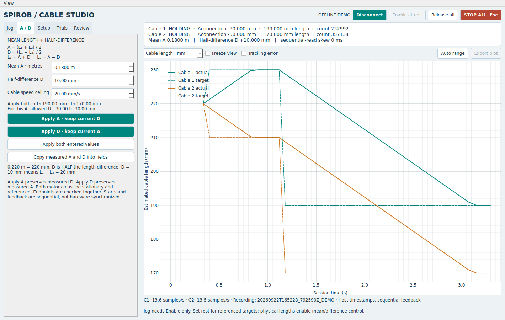

# SpiRob Cable Studio

**Version 3.0.0 — one or two independently addressed RMCS-2303 cable actuators.**

A Python desktop workstation using PySide6, PyQtGraph and PyModbus. It supports independent cable jogging, referenced length targets, mean/half-difference coordinates, finite experiments and timestamped research recordings. The RMCS drive closes the position loop; Python supplies targets and supervises motion.



## Install beside the existing application

Extract `spirob-cable-studio.zip` into `~/Two_Cable_Motor_Setup`, then:

```bash
cd ~/Two_Cable_Motor_Setup/spirob-cable-studio
uv run --python 3.12 app.py --demo
```

The demo opens no serial port. Its two simulated motors use opposite encoder payout signs and a 220 mm physical rest length to exercise the conversions. These values are examples, not hardware defaults.

For hardware, close the demo and import your working configuration once:

```bash
uv run app.py --import-config ../SpiRob_Research_Studio_v2_1/config.json
```

If your old folder has another name, use that folder's `config.json`. The import preserves your working cable-1 ID, geometry, direction and speeds. It initially selects **One cable**, and leaves the second ID unset.

In **Setup**, choose **Two cables**, enter cable 2's verified device ID and serial port, and check its payout direction and geometry. Use the same port for a correctly wired shared interface or different ports for two adapters. Both IDs must be different. The application does not reprogram addresses. Click **Save configuration**. Subsequent launches:

```bash
uv run app.py
```

With no imported file, the GUI starts with unassigned IDs and calibration selections; it cannot connect until valid settings are entered. `config.example.json` documents the format. Working `config.json` and research logs are excluded from Git.

## What changed from 2.1

- Jogging needs **Connect → Enable**. Setting rest is optional for setup jogging.
- Removed the previous 0.5 mm step cap, ±2 mm setup window and 2 mm/s setup speed cap.
- Each cable has a numeric jog distance and independent jog/target speed. Jogging one cable need not wait for the other cable's separate move to finish.
- Before rest, the explicit setup envelope defaults to **±70 mm from the first encoder position read on connection**. Configure a different envelope before connecting if needed. Releasing and re-enabling does not reset this origin.
- After rest, the required **±70 mm window about physical rest** applies. Every jog endpoint must fit inside the current window. No silent target clamping is used apart from sub-count boundary rounding.
- **Enable at rest** combines enabling both selected motors with reference capture after stationary feedback, when the robot is already at the intended rest and measured rest lengths have been entered.
- Live displacement is plotted from connection onward, including while torque is off. Absolute length is only shown after its physical reference is known.
- One large primary graph; tracking error is optional. Controls scroll separately and diagnostics are hidden initially. The graph was checked at a 1080 × 760 window.

## The three operations

| Operation | Purpose | Motion available afterward |
| --- | --- | --- |
| Connect | Open communication, disable torque, begin feedback and recording. | No motor motion commands. |
| Enable / hold here | Preload the present stationary encoder count as target, then enable position control. | Independent jogs in the setup envelope. |
| Set rest here | Record the intended physical rest and, optionally, its measured cable length. | Rest-relative targets; with known physical lengths, absolute A/D commands. |

Set rest is not required merely to turn or jog the motor. It establishes the relationship between encoder counts and your physical mechanism. Enabling does not deliberately command another position, but capture/enable are sequential, so small correction motion can occur under load.

If both cables are already at their intended physical rest, enter each measured `Rest L` in the Jog tab, connect, then use **Enable at rest**. If they need adjustment, enable them separately, jog into place and use each **Set rest here** button. Rest capture is session-only; release, disconnect and faults invalidate it.

## Flexible jogging

In the **Jog** tab, enter the desired distance per click (for example 1, 5 or 10 mm) and cable speed for each motor. Positive **Pay out** increases free cable length; **Take in** decreases it. Direction is determined by each motor's configured payout sign.

Each click makes one finite position move. The UI permits positive steps from 0.01 to 2000 mm, but the controller only accepts endpoints inside the active cable window and signed 32-bit count range. A 10 mm step is usable from the centre of a ±70 mm window; it is rejected when only 5 mm remains. Short moves still include serial communication, acceleration/deceleration and three stationary samples, so step size and speed affect perceived jogging differently. This is not continuous press-and-hold jogging.

Cable speeds are 0.05–20 mm/s, with an additional 2000 base-motor-RPM application ceiling for small calibrations. These are software ceilings, not validated safe operating speeds for a loaded SpiRob. Speed changes apply to the next move; the running cable's speed fields are locked until it settles. Acceleration remains the imported raw driver setting.

## Mean and half-difference control

The interface uses:

```text
A = (L1 + L2) / 2        mean cable length
D = (L1 - L2) / 2        HALF the cable-length difference
L1 = A + D
L2 = A - D
```

**A is entered in metres; D is entered in millimetres.** Logs and backend calculations consistently use millimetres. Thus entering `A = 0.220 m` means 220 mm. A 10 mm half-difference means the full length difference is 20 mm.

| Mean A | Half-difference D | Cable 1 target | Cable 2 target |
| --- | --- | --- | --- |
| 0.220 m | 0 mm | 220 mm | 220 mm |
| 0.220 m | +10 mm | 230 mm | 210 mm |
| 0.180 m | +10 mm | 190 mm | 170 mm |
| 0.180 m | −5 mm | 175 mm | 185 mm |

- **Apply A** preserves the presently measured D and changes the mean.
- **Apply D** preserves the presently measured A and changes the half-difference.
- **Apply both** uses both entered values.
- **Copy measured A and D** fills the editors with the current measurements without moving anything.

Both cables must be stationary and have known physical rest lengths. These controls also work when the two rest lengths differ. Each target is checked against that cable's own rest ±70 mm. With both rests 220 mm and A = 180 mm, D may only be between −30 and +30 mm. For example, D = 40 mm would command L2 = 140 mm; **both commands are rejected before either target is sent**.

**Endpoints are coordinated; starts are not hardware synchronized.** Both IDs are serviced by one serial worker. The documented protocol commits each target separately, so exact preservation of A or D throughout a move is not guaranteed. Different distances, speed rounding, loads, acceleration and serial delay can cause transient changes. A combined A/D command uses the selected cable speed for each moving cable; it does not synthesize a synchronized trajectory. See [ENGINEERING.md](ENGINEERING.md).

## Data and experiments

The default plot frame is **Since connection**. It is available immediately and stays consistent across rest changes. Select **From rest** or **Cable length** when those quantities are known. Blank absolute traces before reference are intentional. Freeze pauses drawing, not acquisition.

The **Trials** tab supports mean/difference rows or one-cable rest-relative rows. Each row moves, waits for all selected cables to settle, then holds. All rows are prevalidated before the first motion. Stop aborts the remaining procedure; there is no automatic resume. Saved procedure files store A in **millimetres**, even though the table displays metres. `examples/mean_difference_sweep.json` demonstrates the format; it must be reviewed against the physical setup before execution.

Each connection creates a folder under `logs/` containing:

| File | Contents |
| --- | --- |
| `session.json` | Software/dependency versions, mode, calibration, transport, two IDs and configuration. |
| `samples.csv` | One row per individual cable reading, raw count, connection/rest reference, target, length estimate, command RPM, error and acquisition start/end. |
| `pairs.csv` | Mean and half-difference formed from the latest two readings, both timestamps and their skew. |
| `events.jsonl` | Commands, acknowledgements, reference changes, per-move speeds, dispatch timing, notes, experiment state and faults. |

Pair rows are **not simultaneous measurements**. All times are host monotonic acquisition times, not hardware encoder timestamps. The plotted velocity and RPM setting are not direct shaft-speed measurements. Length is encoder-estimated; slip, stretch, slack and multilayer winding are not measured.

The **Review** tab compares up to four recorded sessions and supports earlier single-cable CSV files. It reads recordings without replaying motion. The selected frame at import determines how the new session is displayed; legacy CSVs use their original rest-relative frame. RMSE includes moving transients. File import/export is disabled while either motor is enabled. Complete session export requires disconnect so files are closed.

## Validate and publish the repository

```bash
QT_QPA_PLATFORM=offscreen uv run python -m unittest discover -s tests -v
```

**48 local tests pass**, including real Qt event-loop tests with two simulated drives, register handling, setup jogging, sign/gear conversion, A/D math and bounds, partial-command failure, both-drive stop/fault handling, configuration import and recording. Screenshots are from simulation. No physical two-motor bench was connected during development. The included GitHub Actions workflow has not yet run remotely.

For GitHub publishing, follow [GITHUB_SETUP.md](GITHUB_SETUP.md). The delivered folder is initialized as a Git repository on `main`, with an initial commit. It has no remote configured. Research data and local device configuration remain outside version control.

Read [OPERATIONS.md](OPERATIONS.md) for a step-by-step explanation of setup, length calibration and the two coordinates.
